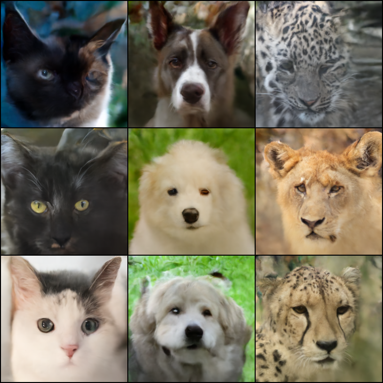
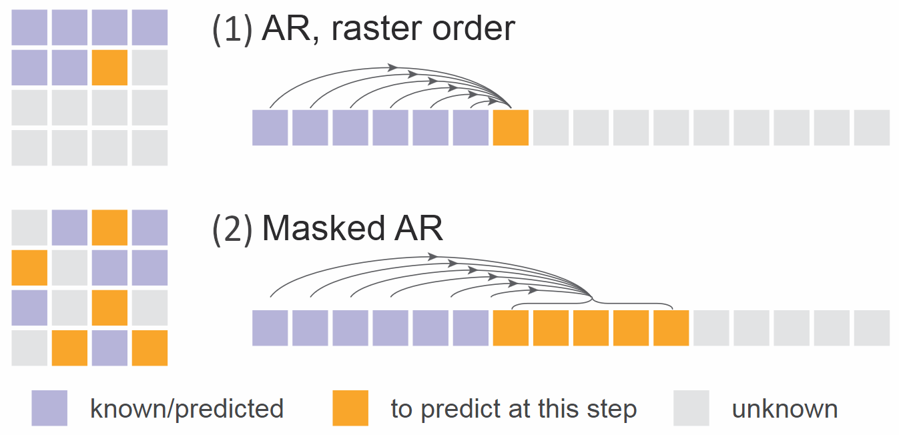

arflow
======

<p align="center">
    
</p>

Simple PyTorch reference implementations of autoregressive image generators using flow matching.

The models are based on the method proposed in [Li et. al. (2024)](https://arxiv.org/abs/2406.11838) but using a rectified flow loss instead of DDPM and trained in pixel space.

Two model variants are currently implemented:

1. [models/arflow.py](models/arflow.py): an auto regressive model sampling in raster order.
2. [models/marflow.py](models/marflow.py): a MaskGIT/MAR-style masked autoregressive model.

<p align="center">
    <br>
    Figure adapted from Li et al.
</p>

The included sample project trains a class-conditional model on the [Animal Faces-HQ V2](https://github.com/clovaai/stargan-v2/blob/master/README.md#animal-faces-hq-dataset-afhq) dataset at 256x256 resolution. Classifier-free guidance is implemented by randomly assigning class label `0` (no class) to 10 % of samples during training.

## Installation

Clone the repository:

```sh
git clone https://github.com/SimonLarsen/arflow.git
cd arflow
```

Create and virtual environment and install dependencies:

```sh
python -m venv venv
source venv/bin/activate
pip install -r requirements.txt
```

## Training

Configure training job by editing the relevant configuration file in `configs`.

Then configure the training system using `accelerate` and launch training:

```sh
accelerate config
accelerate launch train.py --config configs/arflow-256-afhqv2-class-cfg.json
```

## Inference

Both models implement a `sample()` method for sampling images.

```python
from torchvision.utils import make_grid
from torchvision.transforms.functional import to_pil_image
from frogbox.utils import load_model_checkpoint

device = torch.device("cuda:0")
model, _ = load_model_checkpoint("path/to/checkpoint.pt")
model = model.eval().to(device)

images = model.sample(
    num_images=3,
    classes=[1, 2, 3],
    guidance_scale=2.0,
)
grid = make_grid(images)
to_pil_image(grid).save("outputs.png")
```
